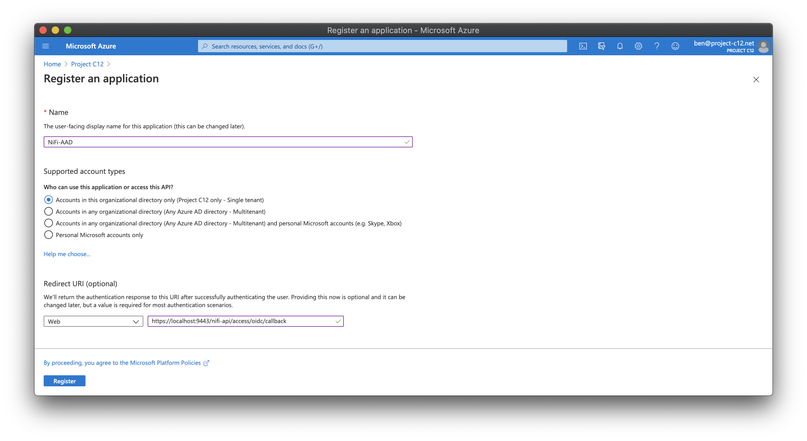
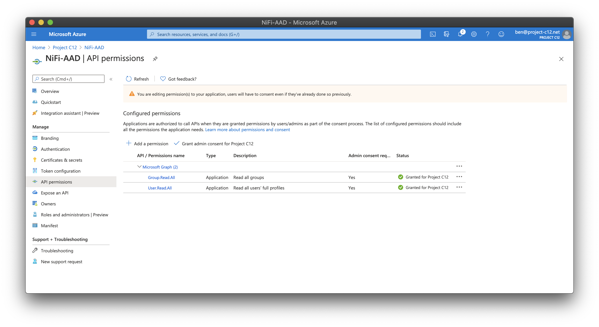
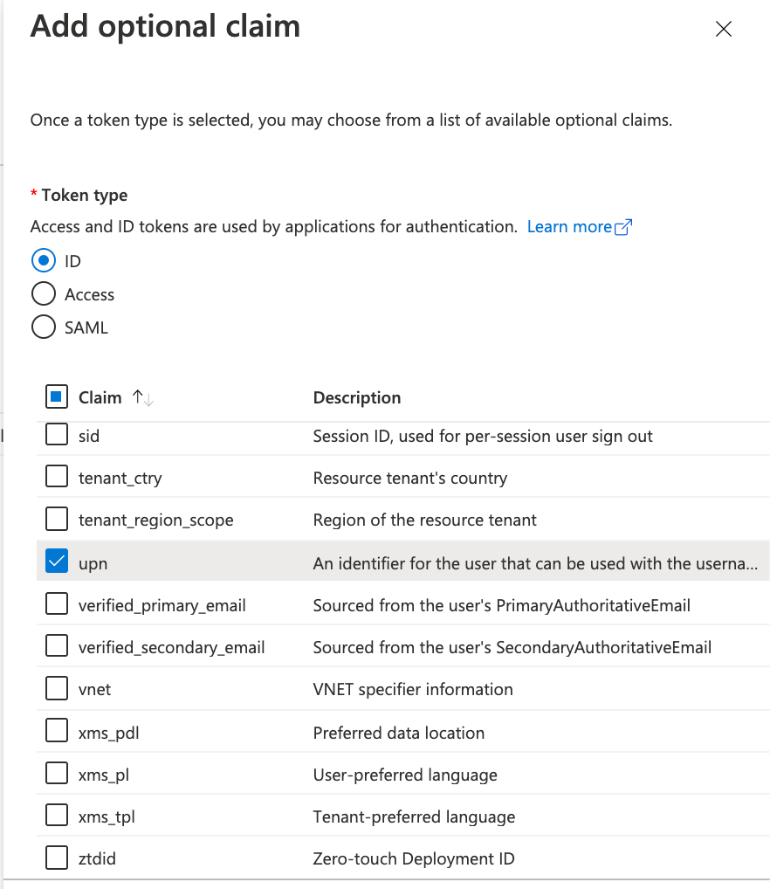
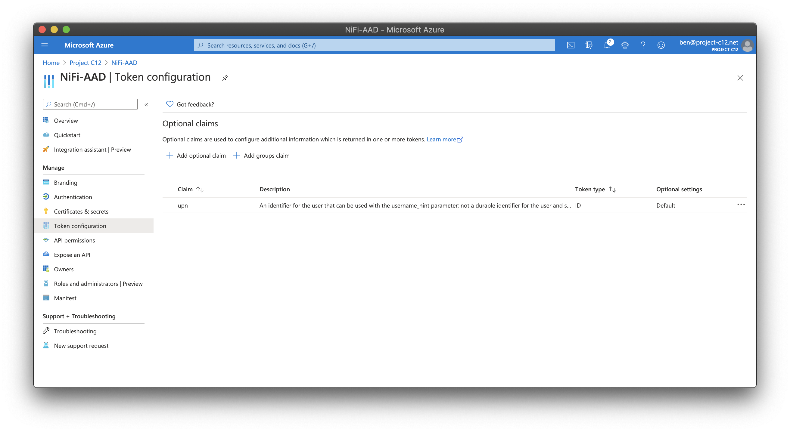
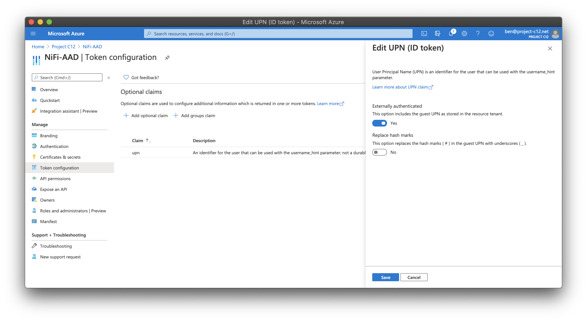
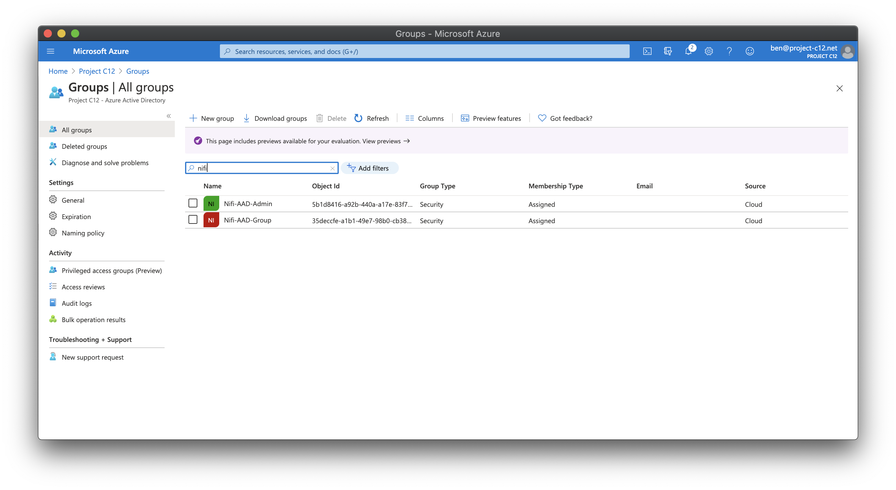
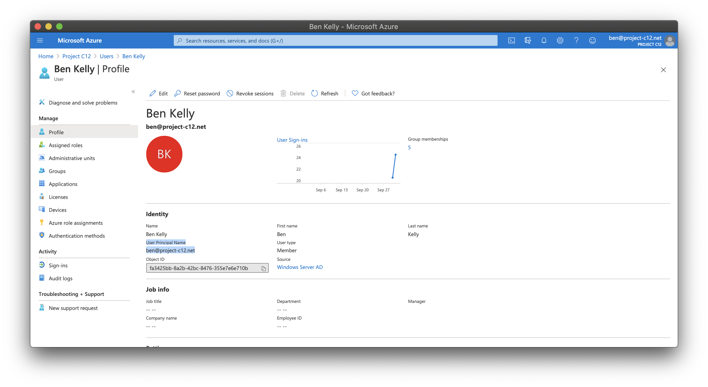
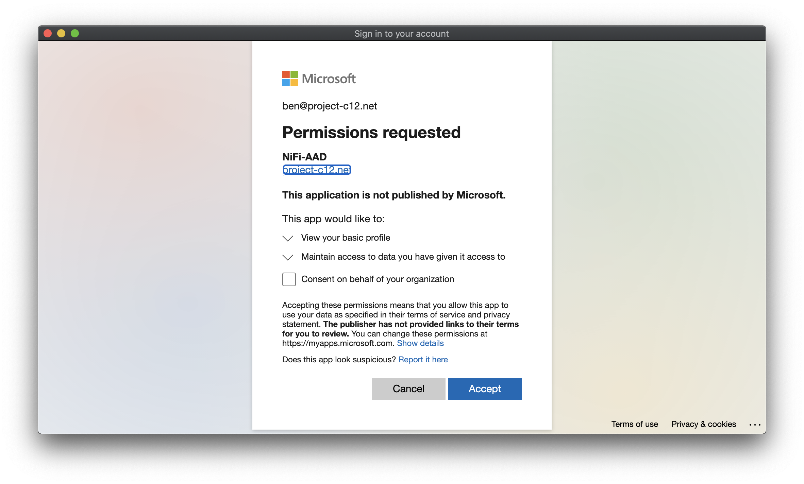
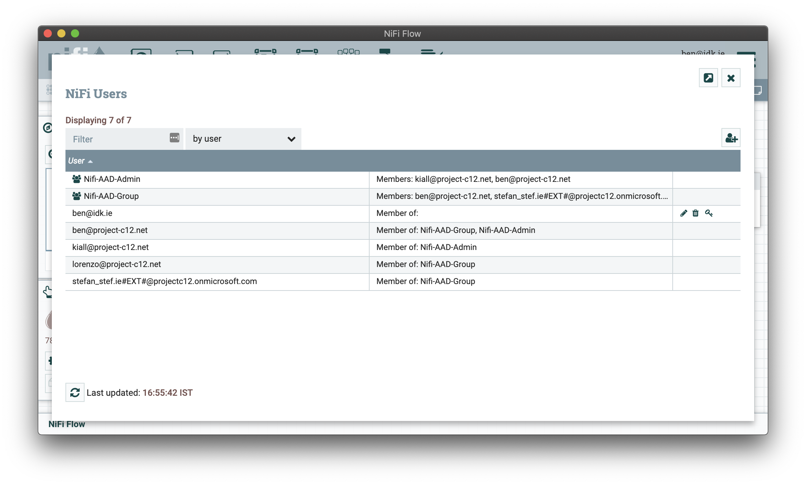
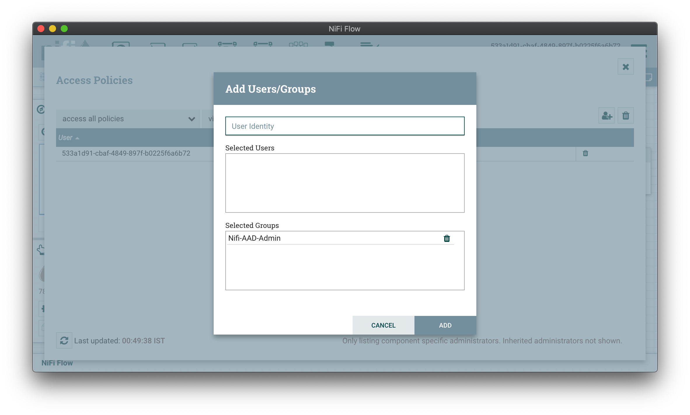

# Setting up AAD Auth with NiFi

## Pre-recks

- Admin access to Azure Active Directory Tenant.
  - Abilities require to proform:
    - Create Registart Applications.
    - Create User Security Groups.
    - Grant AAD Group Read roles to Service principle.

## Steps for a simple example AAD setup using Group Access policy

### Create Registered Application in Azure Active Directory portal

1. Create Registered Application in Azure Active Directory portal located at [portal.azure.com](http://portal.azure.com/), and navigate to **Azure Active Directory**, and select **App registrations**.

2. Once there select **`+` New Registration** and enter the name of your Nifi-AAD Application and also the Redirect URL to Be used by AAD to return to NiFi with the Users Authentication token. This will be your NiFi's domain followed by `/nifi-api/access/oidc/callback`, so for example a test Nifi on localhost with TLS enabled will be `https://localhost:9443/nifi-api/access/oidc/callback`
  

3. Once the Registered Application is created, note the **Application (client) ID** value referenced in the **Overview** property for the Application. This will be the `APP_REG_CLIENT_ID` in the `conf/authorizers.xml` and the `nifi.security.user.oidc.client.id` in `conf/nifi.properties`
4. Now to create a Client sectet, navigate within its properties to **Certificates & secrets** and create a new **Client secrets** this will be used for the `APP_REG_CLIENT_SECRET` in the `conf/authorizers.xml` and the `nifi.security.user.oidc.client.secret` in `conf/nifi.properties`.
5. Now Grant this App the following roles `Group.Read.All` and `User.Read.All` in the **API permissions** property. Remembering to apply the ✅ **Grant Consent for YOUR_TENANT**
  
6. Now an Extra token is required for OpenID to authenticate successfully from the User Principal Name (UPN) which can be done by navigate within its properties to **Token configuration** and create a new token by selecting **Add optional claim**. For **Token type** choose **ID** and then tick the box to **Clam** only **UPN**, create then click edit on the newly created claim and enable **Externally authenticated**   


### Create AAD Groups in Azure Active Directory portal

1. Now Create the NiFi Groups access and polices NiFi will enforce.
2. in the [portal.azure.com](http://portal.azure.com/), navigate to **Azure Active Directory**, and select **Groups**.
3. To create a group select **`+` New group**  and create your group and add users to it as members or owners.
   > __NOTE__ the Prex you give you groups is important for the NiFi AAD Group sync module to function correctly.
   > <br> i.e. label your user and admin group `Nifi-AAD-{admin OR user}` <br> <br> Allowing the configuration of`"GROUP_FILTER_PREFIX"=Nifi-AAD` in  `conf/authorizers.xml` to process both user lists and attach different policies  on each independent group within NiFi.
    

### Configuring NiFi for AAD Auth

1. Set up NiFi to run over TLS as required for User-based Authentication to be enabled. For more information see the Nifi-toolkit [walkthrough](https://nifi.apache.org/docs/nifi-docs/html/walkthroughs.html) about enabling TLS for a local instance.

2. Set up you OpenId properties to point to the created prevously. These are located in `conf/nifi.properties`.

```properties
# OpenId Connect SSO Properties #
nifi.security.user.oidc.discovery.url=https://login.microsoftonline.com/<YOUR_TENENT_ID>/v2.0/.well-known/openid-configuration
nifi.security.user.oidc.connect.timeout=5 secs
nifi.security.user.oidc.read.timeout=5 secs
nifi.security.user.oidc.client.id=<YOUR_APPLICATION_CLIENT_ID>
nifi.security.user.oidc.client.secret=<YOUR_APPLICATION_CLIENT_SECRET>
nifi.security.user.oidc.preferred.jwsalgorithm=
nifi.security.user.oidc.additional.scopes=profile
nifi.security.user.oidc.claim.identifying.user=upn
```

3. Next, configure `conf/authorizers.xml` to enable a `file-user-group-provider` provider for initial SystemAdminastration and the `aad-user-group-provider` for Group Sync. 

Example `authorizers.xml`:
```xml
<authorizers>
    <userGroupProvider>
        <identifier>file-user-group-provider</identifier>
        <class>org.apache.nifi.authorization.FileUserGroupProvider</class>
        <property name="Users File">./conf/users.xml</property>
        <property name="Legacy Authorized Users File"></property>
        <property name="Initial User Identity 1">SYS_ADMIN_AAD_UPN</property>
    </userGroupProvider>

    <userGroupProvider>
        <identifier>aad-user-group-provider</identifier>
        <class>org.apache.nifi.authorization.azure.AzureGraphUserGroupProvider</class>
        <property name="REFRESH_DELAY">1 mins</property>
        <property name="AUTHORITY_ENDPOINT">https://login.microsoftonline.com</property>
        <property name="TENANT_ID">YOUR_TENANT_ID</property>
        <property name="APP_REG_CLIENT_ID">YOUR_APPLICATION_CLIENT_ID</property>
        <property name="APP_REG_CLIENT_SECRET">YOUR_APPLICATION_CLIENT_SECRET</property>
        <property name="GROUP_FILTER_PREFIX">Nifi-AAD</property>
        <property name="PAGE_SIZE">100</property>
    </userGroupProvider>

    <userGroupProvider>
        <identifier>composite-configurable-user-group-provider</identifier>
        <class>org.apache.nifi.authorization.CompositeConfigurableUserGroupProvider</class>
        <property name="Configurable User Group Provider">file-user-group-provider</property>
        <property name="User Group Provider 1">aad-user-group-provider</property>
    </userGroupProvider>

    <accessPolicyProvider>
        <identifier>file-access-policy-provider</identifier>
        <class>org.apache.nifi.authorization.FileAccessPolicyProvider</class>
        <property name="User Group Provider">composite-configurable-user-group-provider</property>
        <property name="Authorizations File">./conf/authorizations.xml</property>
        <property name="Initial Admin Identity">SYS_ADMIN_AAD_UPN</property>
        <property name="Legacy Authorized Users File"></property>
        <property name="Node Identity 1"></property>
    </accessPolicyProvider>

    <authorizer>
        <identifier>managed-authorizer</identifier>
        <class>org.apache.nifi.authorization.StandardManagedAuthorizer</class>
        <property name="Access Policy Provider">file-access-policy-provider</property>
    </authorizer>
</authorizers>
```

> __NOTE__ To obtain the `SYS_ADMIN_AAD_UPN` value can be done by going to  [portal.azure.com](http://portal.azure.com/), navigate to **Azure Active Directory**, and select **User**, Search for the user wished to be used for the Initial System Administration and fetching their `User Principal Name` value from the properties. 

### Configuring NiFi Group Access Policy

1. Now run you NiFi instance with the Configuration, logging onto the NiFi web appl now should re-direct you to a Microsoft Branded Login portal.
2. Login with the User that the `SYS_ADMIN_AAD_UPN` was specified for.
   > __NOTE__ You may need to accept logging into a Non-Microsoft Application for the First time. <br> As AAD Admin; selecting `Consent on behalf of your organization` should avoid this from happening again. 

3. You should now have been successfully authenticated and redirected into the NiFi Canvas.
4. To verify the AAD Group Sync Provider is working and picking the created Groups, select the **hamburger menu** (top-right) and select **Users**, their should be User Principal Name (UPN) references for all the users within the AAD Groups and also the Groups listed also. 
5. To Enforce Groups to certain abilities and pollicies, select again the **hamburger menu** (top-right) and select **Policies**.
6. Now select each policy you wish to enforce, then select the add button the right of the table, and type in the group you wish to have entitlement to that policy. 
7. Now Users in that AAD group will have access to that policy when they login.
